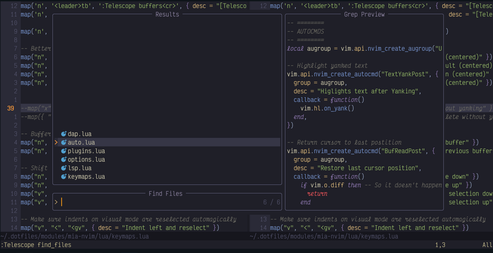

# Mia-nvim
This is my neovim configuration from scratch that I use daily to write code º^º

## Features
- LSP and Autocompletion
- Native package manager
- Mason auto-install for LSP Servers
- Not a lot of plugins (as time of writing)

## Stuff to implement
- [ ] A snip engine
- [ ] Tooling for Web development

Side note: Still trying to decide whether I use
telescope, FzFLua or mini.picker for files and such

## Preview

